# 👋 Hi, I'm Alishan

I'm a B.Tech CSE student learning software development by **building projects and experimenting with code**.

🌱 Currently learning **JavaScript, C, C++, Data Structures & Algorithms, and Full-Stack Web Development**

🔭 Currently working on **web development projects**

💬 Interested in **building software, exploring new technologies, solving problems, and understanding how things work under the hood**
---

## 🛠️ Tech Stack

- C
- HTML
- CSS
- JavaScript
- Git
- GitHub

---

## 🚀 Projects

Some of the projects I've built while learning:

- 🎨 **[Etch A Sketch](https://github.com/alishancodes/sketch)** — JavaScript DOM manipulation and events
- ✊ **[Rock Paper Scissors](https://github.com/alishancodes/rock-paper-scissors)** — JavaScript game
- ✅ **[Todo App](https://github.com/alishancodes/todo_7b)** — HTML, CSS & JavaScript
- 📝 **[Wordle](https://github.com/alishancodes/wordle)** — JavaScript-based Wordle project
- 🍳 **[Odin Recipes](https://github.com/alishancodes/odin-recipes)** — HTML/CSS fundamentals
- 🛒 **[Landing Page](https://github.com/alishancodes/landing-page)** — HTML & CSS
- 🛍️ **[Dynamic Shopping List](https://github.com/alishancodes/shopping_list)** — JavaScript DOM Manipulation

---

## 📚 Currently Learning

```text
Web Development
      ↓
JavaScript
      ↓
C++ + Data Structures & Algorithms
      ↓
Backend Development
      ↓
Python + AI/ML
````

I prefer learning by **building things rather than just watching tutorials**.

---

## 🎯 Goals

- Build strong CS fundamentals
- Become a strong full-stack developer
- Master DSA and problem solving
- Explore AI/ML, embedded systems, and research
- Keep learning by building

---

## 📊 GitHub Stats






## 🐍 GitHub Contribution Snake

<picture>
  <source
    media="(prefers-color-scheme: dark)"
    srcset="https://raw.githubusercontent.com/alishancodes/alishancodes/output/github-snake-dark.svg"
  />
  <source
    media="(prefers-color-scheme: light)"
    srcset="https://raw.githubusercontent.com/alishancodes/alishancodes/output/github-snake.svg"
  />
  
</picture>

## 🌐 Connect With Me

[](https://linkedin.com/in/md-alishan-hussain-b1542b360)

[](mailto:demonbrzrkr@gmail.com)


---

**Learning by building. One project at a time.**
